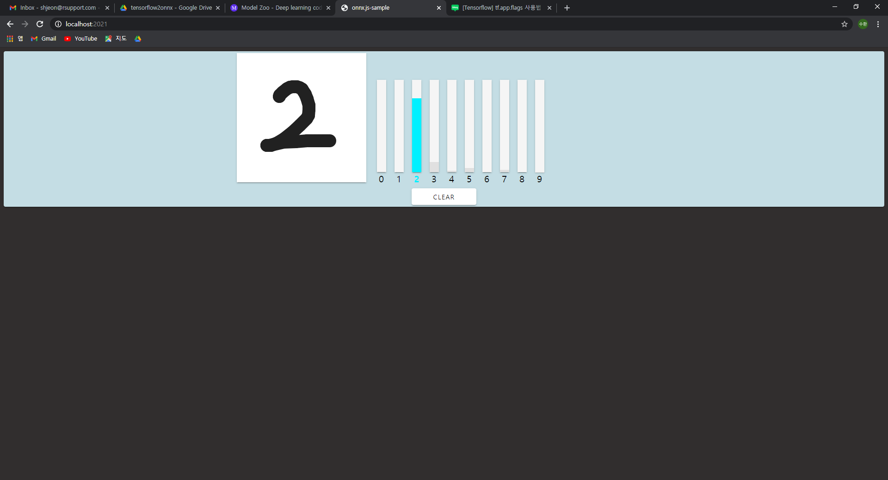
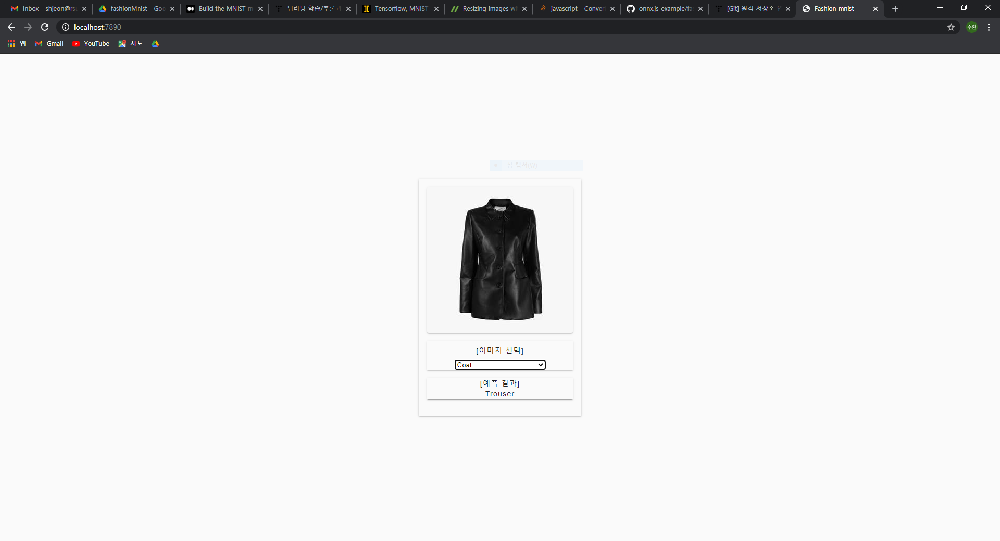

# onnx.js-example
ONNX.js를 사용해보기 위한 샘플입니다.

Reference from [https://github.com/elliotwaite/pytorch-to-javascript-with-onnx-js](https://github.com/elliotwaite/pytorch-to-javascript-with-onnx-js) 
(elliowaite/pytorch-to-javascript-with-onnx-js)

-------------------------------------------------------------------

<h3>Result (Mnist model)</h3>

<h3>Result2 (Fashion_mnist model)</h3>

